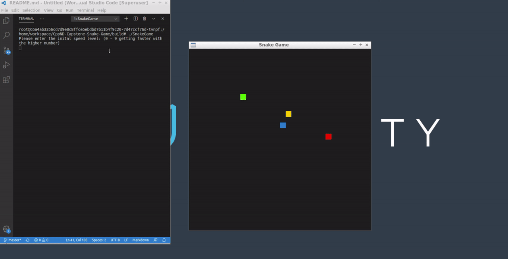

# CPPND: Capstone Snake Game

This is a starter repo for the Capstone project in the [Udacity C++ Nanodegree Program](https://www.udacity.com/course/c-plus-plus-nanodegree--nd213). The code for this repo was inspired by [this](https://codereview.stackexchange.com/questions/212296/snake-game-in-c-with-sdl) excellent StackOverflow post and set of responses.

The Capstone Project gives you a chance to integrate what you've learned throughout this program. This project will become an important part of your portfolio to share with current and future colleagues and employers.

In this project, you can build your own C++ application or extend this Snake game, following the principles you have learned throughout this Nanodegree Program. This project will demonstrate that you can independently create applications using a wide range of C++ features.

## Demo

## Dependencies for Running Locally
* cmake >= 3.7
  * All OSes: [click here for installation instructions](https://cmake.org/install/)
* make >= 4.1 (Linux, Mac), 3.81 (Windows)
  * Linux: make is installed by default on most Linux distros
  * Mac: [install Xcode command line tools to get make](https://developer.apple.com/xcode/features/)
  * Windows: [Click here for installation instructions](http://gnuwin32.sourceforge.net/packages/make.htm)
* SDL2 >= 2.0
  * All installation instructions can be found [here](https://wiki.libsdl.org/Installation)
  >Note that for Linux, an `apt` or `apt-get` installation is preferred to building from source. 
* gcc/g++ >= 5.4
  * Linux: gcc / g++ is installed by default on most Linux distros
  * Mac: same deal as make - [install Xcode command line tools](https://developer.apple.com/xcode/features/)
  * Windows: recommend using [MinGW](http://www.mingw.org/)

## Basic Build Instructions

1. Clone this repo.
2. Make a build directory in the top level directory: `mkdir build && cd build`
3. Compile: `cmake .. && make`
4. Run it: `./SnakeGame`.

## Overview of the code structure

The project follows an object-oriented design with clear separation of concerns:

* **main.cpp** - Entry point that initializes the game, controller, and renderer
* **game.h/cpp** - Game class manages the game loop, food/obstacle placement, collision detection, and coordinates player and AI snakes
* **snake.h/cpp** - Base Snake class with movement logic, body management, and collision detection
* **ai_snake.h/cpp** - AISnake class (inherits from Snake) with A* pathfinding algorithm running on a worker thread
* **controller.h/cpp** - Controller class handles user input (keyboard controls and text input for speed settings)
* **renderer.h/cpp** - Renderer class manages SDL2 rendering for both snakes, food, and obstacles

## New features
* User can set the initial starting speed level of the snake by typing interger values within 0 - 9. The speed level is 0 by default.
The mapping of the level and the real speed are: 
  * 0 <-> 0.1
  * 1 <-> 0.11
  * 2 <-> 0.12
  * 3 <-> 0.13 
  * 4 <-> 0.14
  * 5 <-> 0.15
  * 6 <-> 0.16
  * 7 <-> 0.17
  * 8 <-> 0.18
  * 9 <-> 0.19

  * Expected behaviour:
  * Please enter the inital speed level: (0 - 9 getting faster with the higher number)
  * User set initial speed level: 3
  * Init speed level is set to: 0.13
  * User set initial speed level: 4
  * Init speed level is set to: 0.14
  * User set initial speed level: 5
  * Init speed level is set to: 0.15
  * User set initial speed level: 7

  * The snake will move faster when you set a higher number.

* Add the obstacles, when snake's head meets the obstacle, it died. Game over. The obstacle is rendered as a red block, which is different from the food (a yellow block).

* AI-controlled snake with pathfinding on worker thread:
  * An AI snake (green) competes with the player snake (blue) for food
  * Uses A* pathfinding algorithm to navigate toward food while avoiding obstacles and the player snake
  * Pathfinding computation runs asynchronously on a separate worker thread to avoid blocking the game loop
  * Thread-safe implementation using std::mutex to protect shared path data
  * Smart pointer (std::shared_ptr) manages obstacle data shared between threads
  * AI snake continuously recalculates path when food position changes

## How the submission satisfies the necessary rubric
* Compiling and Testing
  * In README.md file: Basic Build Instructions part.

* Loops, Functions, I/O - meet at least 2 criteria
  * A variety of control structures are added to the project. The project code is clearly organized into functions
    * Controller::HandleUserInput is formed into 2 sub-functions and also includes control structures to control the input is the one accepted (keyboard or text) (see controller.cpp Line 53).

  * In addition to controlling the snake, the game can also receive new types of input from the player.
    * The game can also receive the input of the initial starting speed level of the snake from users (see controller.cpp Line 13).

* Object Oriented Programming - meet at least 3 criteria
  * Classes are organized with attributes to hold data and methods to perform tasks. All class data members are explicitly specified as public, protected, or private. Member data that is subject to an invariant is hidden from the user and accessed via member methods.
    * AISnake class has public methods (UpdateAI, StartPathfinding, StopPathfinding) and private data members (pathfinding_thread, path_mutex, stop_thread, path) (see ai_snake.h Line 11-35).

  * All class member functions document their effects, either through function names, comments, or formal documentation. Member functions do not change the program state in undocumented ways.
    * All the class member functions satisfy this. For example, the overloaded functions also state the functionality in comments (see controller.cpp Line 12 and 31).

  * One function is overloaded with different signatures for the same function name.
    * Overloaded the Controller::HandleInput function into two, based on different types of inputs (keyboard or text) (see controller.h Line 11 and 12).

* Memory Management - meet at least 3 criteria
  * At least two variables are defined as references, or two functions use pass-by-reference in the project code.
    * In controller.h Line 11 and 12 both functions pass by reference. 
    * In renderer.h Line 16 pass by reference.
  
  * At least one class that uses unmanaged dynamically allocated memory, along with any class that otherwise needs to modify state upon the termination of an object, uses a destructor.
    * AISnake class uses a destructor to properly clean up the pathfinding thread (see ai_snake.cpp Line 14-16).
  * The project uses at least one smart pointer: unique_ptr, shared_ptr, or weak_ptr.
    * std::shared_ptr is used to manage the obstacles vector shared between threads (see ai_snake.cpp Line 28 and Line 31).

* Concurrency - meet at least 2 criteria
  * The project uses multiple threads or async tasks in the execution.
    * AI snake pathfinding runs on a separate worker thread (see ai_snake.cpp Line 33).
  * A mutex or lock (e.g. std::lock_guard or `std::unique_lock) is used to protect data that is shared across multiple threads in the project code.
    * std::lock_guard protects the path queue accessed by both main and worker threads (see ai_snake.cpp Line 40 and Line 48).

## CC Attribution-ShareAlike 4.0 International

Shield: [![CC BY-SA 4.0][cc-by-sa-shield]][cc-by-sa]

This work is licensed under a
[Creative Commons Attribution-ShareAlike 4.0 International License][cc-by-sa].

[![CC BY-SA 4.0][cc-by-sa-image]][cc-by-sa]

[cc-by-sa]: http://creativecommons.org/licenses/by-sa/4.0/
[cc-by-sa-image]: https://licensebuttons.net/l/by-sa/4.0/88x31.png
[cc-by-sa-shield]: https://img.shields.io/badge/License-CC%20BY--SA%204.0-lightgrey.svg
